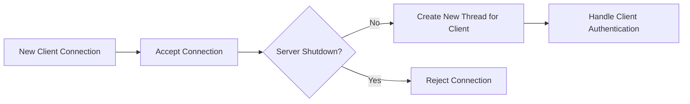
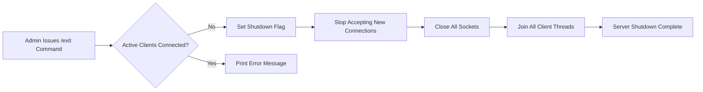

# Assignment README

## Features

### Implemented Features

1. **Authentication**: Users can log in with a username and password.
2. **Broadcast Messaging**: Users can send messages to all connected clients.
This can be done as
```
/broadcast <your message>
```
For other users it appears as
```
[Broadcast message by <user>]: <your message>
```
3. **Private Messaging**: Users can send direct messages to specific connected clients.
```
/msg <user> <your message>
```
For "user" it appears as
```
[<sender>]: <your message>
```
4. **Group Management**:
   - A user can create a group that doesn't already exist.
   ```
   /create_group <group name>
   ```
   It appears as
   ```
   Group <group name> has been created by <user>.
   ```
   - Any user can join or leave an existing group.
   ```
   /join_group <group name>
   /leave_group <group name>
   ```
   This will be informed to all members of the group
   - Any member of the group can send messages.
   ```
   /group_msg <group name> <your message>
   ```
   At appears as
   ```
   [<group name> - <user>]: <your message>
   ```
5. **List Functionalities**
    - Any user can list down all the active users that are connected to the server
    ```
    /list_users
    ```
    - Any user can list down all the groups that exist on the server
    ```
    /list_groups
    ```
6. **Server Shutdown**: Admin can shut down the server with an `/exit` command.

### Not Implemented Features

- Automatic user registration.
- Handling message history or persistent data beyond the current session.

## Design Decisions

### Multi-threaded Handling of Clients

- The server spawns a new thread (`handle_client`) for each client connection to handle client-server communication concurrently.
- **Reason**: Threads allow multiple clients to communicate with the server simultaneously, providing better scalability.

### Mutex Synchronization

- Mutexes (`cout_mutex`, `user_mutex`, `group_mutex`) are used to ensure thread-safe operations on shared data structures.
- **Reason**: Prevents data races and inconsistencies when multiple threads access or modify shared resources.

### Atomic Shutdown Flag

- An atomic boolean (`shutdown_server`) indicates when the server should stop accepting new connections.
- **Reason**: Atomics ensure safe updates across multiple threads without complex locking.

### Non-blocking Accept

- The server uses non-blocking socket operations to avoid indefinitely waiting for connections when the shutdown flag is set.
- **Reason**: Enhances responsiveness during server shutdown.

## Implementation

### High-Level Overview

#### **Server Functions**

   - `main()`: Initializes the server, loads user data, and starts the listener loop.
   - `handle_client()`: Handles authentication and command processing for a connected client.
   - `message_person()`: 
   - `broadcast_message()`: Sends a message to all clients except the sender.
   - `create_group()`: Creates a new group and notifies users.
   - `group_message()`: Sends messages within a group.
   - `listen_for_exit_command()`: Monitors the console for the `/exit` command.

### Server Code Flow

The following diagrams describe the main components of the server's code execution:

#### 1. Server Initialization

#### 2. Handling new connections


#### 3. Client Communication (Thread)

```mermaid
flowchart LR
    A[Client Thread Start] --> B[Send Authentication Request]
    B --> C{Valid Credentials?}
    C -- Yes --> D[Add User to Active Clients]
    C -- No --> E[Send Authentication Failure]
    D --> F[Wait for Client Commands]
    
    subgraph Command Handling Loop
        F --> G{Command Type?}
        G --> H[&#47;broadcast] --> I[Send Broadcast Message]
        G --> J[&#47;msg] --> K[Send Private Message]
        G --> L[&#47;create_group] --> M[Create Group]
        G --> N[&#47;group_msg] --> O[Send Group Message]
        G --> P[&#47;exit] --> Q[Close Client Connection]
    end
    
    Q --> R[Remove User from Active Clients]
```


#### 4. Server Shutdown



## Testing

### Correctness Testing

- Tested individual features by connecting multiple clients and verifying message delivery.
- Ensured proper handling of authentication errors.

### Stress Testing

To test the server's performance under heavy load, we wrote a bash script to simulate multiple client connections, with each client sending 50 messages. The test revealed that the server could handle up to **250 concurrent clients** before performance degraded significantly.

#### Bash Script for Stress Testing

##### stress_test_chat.sh

```bash
#!/bin/bash

# Ask user for the number of clients
read -p "Enter the number of clients to simulate: " NUM_CLIENTS

# Check if input is a valid number
if ! [[ "$NUM_CLIENTS" =~ ^[0-9]+$ ]]; then
    echo "Error: Please enter a valid number."
    exit 1
fi

# Run multiple clients, each in a new terminal window
for ((i = 1; i <= NUM_CLIENTS; i++)); do
    # Open a new terminal, run the expect script, and close the terminal when done using exec bash and exit
    gnome-terminal -- bash -c "ID=$i expect ./client_expect.sh; exec bash -c 'exit'" &
done

wait
echo "Stress test completed with $NUM_CLIENTS clients!"
```

##### client_expect.sh

```bash
#!/usr/bin/expect -f

set timeout 10
set username "user$env(ID)"
set password "password$env(ID)"

# Spawn the client program
spawn ./client_grp

# Wait for username prompt and send the username
expect "Enter username:"
send "$username\r"

# Wait for password prompt and send the password
expect "Enter password:"
send "$password\r"

# Wait for any prompt (e.g., main menu or chat prompt)
# expect ">"   # Modify this if needed based on actual prompt
# expect ">"
# Send the message to 'alice'
send "/msg alice hi\r"

# Keep sending 50 messages to the server (simulating a conversation or repeated messages)
for {set i 1} {$i <= 50} {incr i} {
    # expect ">"   # Wait for server prompt (modify this if needed)
    send "/msg alice hi $i\r"
    sleep 0.1
}

send "/exit\r"

# Keep the session alive and interactive if needed
interact
```

## Restrictions

- **Maximum Clients:** No fixed limit; depends on system resources. Can support upto 200 users on a regular system.
- **Maximum Groups:** No fixed limit; dynamically managed.
- **Maximum Group Members:** No fixed limit; determined by server performance.
- **Maximum Message Size:** 1024 bytes.

## Challenges

1. **Thread Synchronization Issues**: Faced occasional deadlocks when multiple threads accessed shared resources.

   - **Solution**: Introduced fine-grained locks for specific operations.

2. **Socket Errors**: Errors during client disconnection led to resource leaks.

   - **Solution**: Added error handling and resource cleanup.

3. **Authentication Logic**: Difficulty in ensuring unique logins.

   - **Solution**: Checked for duplicate usernames before granting access.

## Scenarios and Behavior

1. **What happens when a user sends a message to a non-existing or inactive user?**
   - The application throws an error: "User not found."

2. **What happens when a user tries to send a message in a group they are not a part of?**
   - The application throws an error: "You are not part of this group."

3. **What happens if a user tries to create a group with an existing name?**
   - The application throws an error: "Group already exists."

4. **What happens if the server is shut down while clients are connected?**
   - Clients receive a disconnect message and are automatically logged out.

5. **What happens when a user tries to log in with incorrect credentials?**
   - The application sends a message: "Authentication failed. Disconnecting..."

6. **What happens when multiple users send broadcast messages simultaneously?**
   - Messages are queued and delivered in order of receipt.

7. **What happens when a user tries to join a non-existent group?**
   - The application sends an error message: "Group not found."

8. **What happens if a client closes connection without exiting a group?**
    - The user is still a part of the group and can send messages in the group for logging in again.

## Contribution of Each Member

### Server Design and Implementation

| Member Name | Percentage |
| ----------- | ---------- |
| Animesh Madaan    | 50%        |
| Sankalp Mittal    | 50%        |

### Testing and bug fixes

| Member Name | Percentage |
| ----------- | ---------- |
| Animesh Madaan    | 30%        |
| Sankalp Mittal    | 70%        |

### Documentation and README preparation

| Member Name | Percentage |
| ----------- | ---------- |
| Animesh Madaan    | 70%        |
| Sankalp Mittal    | 30%        |

## Sources Referred

- C++ documentation.
- Online tutorials on socket programming.
- Blogs on multi-threaded server design.

## Declaration

We declare that the assignment was completed independently and no instances of plagiarism occurred.

## Feedback

- The assignment was well-structured, but clearer requirements on message and group management would have been helpful.
- Testing with edge cases was challenging due to a lack of predefined test cases.